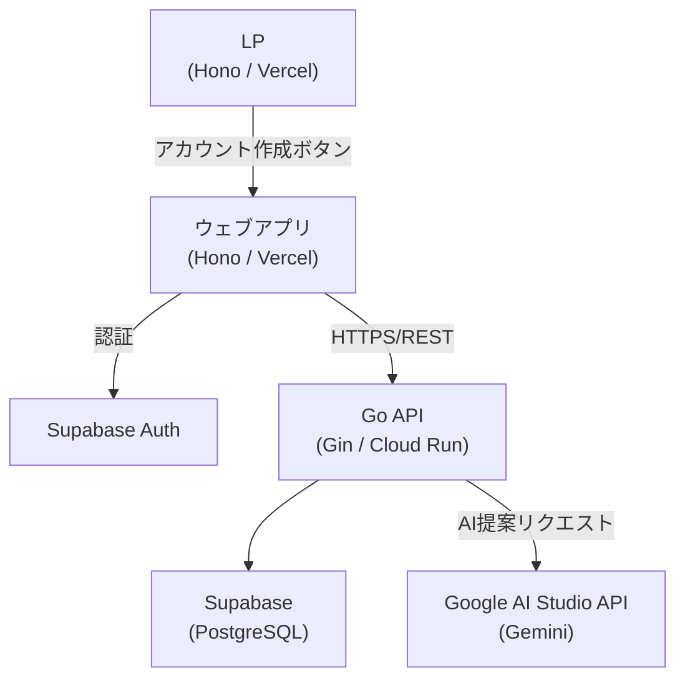

# システム概要

## 目的

**店舗側**: アップサイクルが難しい商品をなんとかしたい店舗と、**ユーザー側**: 夜食に困っていたり、バイト終わりで疲れてコンビニで不健康なものを買いがちな学生をつなぐ。健康的なサラダや本格的な賄い飯を、そうしたニーズに届けるサービスを開発する。スマホアプリで在庫を確認したり、AIがその日の気分に合った料理を提案。LP との連携も行う。

**本システムのスコープ**: ビジネスコンテスト用の仮システムのため、**店舗向けの管理画面・API は用意しない**。在庫・商品データは Supabase のダッシュボードやシードで投入し、学生（ユーザー）向けのアプリ・API のみを実装する。

## 技術スタック

| 領域 | 採用技術 |
| --- | --- |
| フロント / LP | Hono（Vercel）/ PWA（Progressive Web App） |
| バックエンドAPI | Go（Gin）/ Cloud Run |
| ホスティング | Vercel（フロント）/ GCP Cloud Run（バックエンド） |
| 認証 | Supabase Auth（`@supabase/supabase-js` で認証・DB・セッション管理を統一） |
| データベース | Supabase（PostgreSQL） |
| AI提案 | Google AI Studio API（`github.com/google/generative-ai-go`）/ 本番化時に Vertex AI へ移行 |
| インフラ | Terraform（GCP のプロビジョニング。Vercel は Terraform 外で管理） |
| フロント 3D | Three.js（広場シーン・キャラクター） |
| フロント UI（アイコン） | react-icons で統一 |

---

# システム設計

## アーキテクチャ概要



## 構成要素詳細

### LP / フロント（Hono / Vercel）

- Hono の JSX サポートを使い、Vercel 上で SSR/静的ページを配信
- LP・アプリは同一 Vercel プロジェクト内で管理可能（ルーティングで分離）
- 「アカウントを作成する」ボタンからサインアップ画面へ誘導
- Go API へのリクエストはフロントから直接送る（HTTPS/REST）

### 認証システム

- Supabase Auth を利用
- 認証方式はメール（ワンタイムパスワード）またはGoogleログイン
- LP からアプリへの遷移時にそのまま登録・ログイン画面へ誘導
- フロントは Supabase のセッションを保持し、Go API 呼び出し時にアクセストークンを付与
- Supabase の RLS（Row Level Security）でユーザーごとのデータアクセス制御を行う

### バックエンドAPI（Go / Gin / Cloud Run）

- **クリーンアーキテクチャ** に準拠し、依存関係を内側向きに保つ（ドメイン → ユースケース → アダプタ → インフラ）
- Gin は HTTP の**アダプタ**としてのみ使用し、ルーティング・リクエスト/レスポンスの変換のみ担当
- 主要エンドポイント
    - `GET /api/products`：商品一覧・在庫情報を返す（ユースケース経由でリポジトリ取得）
    - `POST /api/suggest`：気分・在庫をユースケースに渡し、AI ゲートウェイ経由で Gemini を呼び出して提案を返す
- CORS 設定で Vercel ドメインからのリクエストのみ許可

### インフラ（Terraform）

- インフラの定義・プロビジョニングは **Terraform** で管理する
- GCP（Cloud Run、必要に応じて IAM・Secret Manager 等）をコード化。Vercel は Terraform では管理せず、Vercel ダッシュボード等で別途設定する
- 環境ごと（dev / staging / prod）の tfvars や workspace で切り替え可能にする

### 商品選択画面

- Supabase から在庫一覧を取得して表示
- 商品カード形式で残り数・割引率・有効期限を表示
- コンテストのため実際の決済処理は不要

### 自動提案 AI

- `POST /api/suggest` でユーザーの入力（今日の気分・アレルギー等）を受け取る
- Go API が Supabase から在庫データを取得し、AIに渡す候補を絞り込む
    - `stock > 0` のもののみ対象
    - `expires_at`（賞味期限）が近い順に優先
    - 上位 N 件（例: 20 件）に制限してAIへ渡す
- 絞り込んだ在庫データとユーザー入力からプロンプトを生成
- Go API が Google AI Studio API（Gemini）を呼び出し、おすすめ商品リストを返す

## データベース設計（Supabase / PostgreSQL）

本システムで扱うデータは **学生（ユーザー）** と **商品** の2軸。認証は Supabase Auth に任せ、ユーザー情報は `profiles` で拡張する。商品は `stores` → `products` → `inventory` の3テーブルで表現する。注文はモック用に `orders` / `order_items` を用意する。

### 学生（ユーザー）まわり

| テーブル | 説明 | 主なカラム |
| --- | --- | --- |
| `auth.users` | Supabase Auth 標準。本設計では触れない。 | （Supabase 管理） |
| `profiles` | 認証ユーザーと 1:1 のプロファイル（学生向け追加情報） | `id` (uuid, PK, auth.users と同一), `display_name` (text), `allergies` (text[]), `created_at`, `updated_at` |

- `id` は `auth.users.id` と一致させ、サインアップ時にトリガで 1 行挿入する想定。
- `allergies` は AI 提案（`/api/suggest`）で「避けたい食材」として利用。

### 商品まわり

| テーブル | 説明 | 主なカラム |
| --- | --- | --- |
| `stores` | 店舗（商品の所属先）。コンテスト用にシード投入。 | `id` (uuid, PK), `name` (text), `floor` (text), `section` (text), `created_at` |
| `products` | 商品マスタ（サラダ・賄い飯など） | `id` (uuid, PK), `store_id` (uuid, FK → stores), `name` (text), `category` (text: "サラダ" / "賄い飯" 等), `price` (integer), `image_url` (text), `created_at` |
| `inventory` | 在庫（1商品1レコードで管理） | `id` (uuid, PK), `product_id` (uuid, FK → products, UNIQUE), `stock` (integer), `discount_rate` (integer 0–100), `expires_at` (timestamptz), `updated_at` |

- `category` は「サラダ」「賄い飯」など、目的（健康的・本格的な夜食）に合わせて運用で決める。
- 在庫は商品ごとに 1 行。`stock > 0` かつ `expires_at` が有効なものを一覧・AI 提案の対象とする。

### 注文（モック）

| テーブル | 説明 | 主なカラム |
| --- | --- | --- |
| `orders` | 注文ヘッダ | `id` (uuid, PK), `user_id` (uuid, FK → auth.users), `status` (text: "pending" / "completed"), `created_at` |
| `order_items` | 注文明細 | `id` (uuid, PK), `order_id` (uuid, FK → orders), `product_id` (uuid, FK → products), `quantity` (integer) |

- 決済は行わず、注文フローと履歴のデモ用。

### RLS（Row Level Security）方針

| テーブル | 方針 |
| --- | --- |
| `profiles` | 認証ユーザーは自分自身の行のみ SELECT / UPDATE 可能。INSERT はサインアップ時トリガで実行。 |
| `stores`, `products`, `inventory` | 全テーブル **誰でも SELECT 可**（未認証も可）。INSERT/UPDATE/DELETE は行わない（店舗側システムなしのため、管理画面や API で更新しない想定）。 |
| `orders`, `order_items` | 認証ユーザーは自分が作成した注文のみ SELECT/INSERT。UPDATE は必要に応じて status 更新のみ。 |

### 初期データ・マイグレーション

- テーブル作成は Supabase の SQL エディタまたは `backend/infrastructure/db/migrations/` のマイグレーションで実行する。
- **SQL ファイルの命名**: 連番で管理する。`0001_xxx.sql`, `0002_xxx.sql` のように、`0001` から始まる4桁番号 + `_` + 内容を表すスラッグ（英数字・アンダースコア）とする。例: `0001_create_stores_and_products.sql`, `0002_create_inventory.sql`。
- 店舗・商品・在庫の初期データは SQL シードで投入する（店舗向け画面がないため）。

---

# API設計詳細

## エンドポイント一覧

| メソッド | パス | 説明 | 認証 |
| --- | --- | --- | --- |
| GET | `/api/products` | 商品一覧と在庫情報を取得 | 不要 |
| GET | `/api/products/:id` | 商品詳細を取得 | 不要 |
| GET | `/api/stores` | 店舗一覧を取得 | 不要 |
| POST | `/api/suggest` | 気分を送信しAI提案を取得 | 必要 |
| POST | `/api/orders` | 注文を作成（モック） | 必要 |
| GET | `/api/users/me` | ログイン中のユーザー情報を取得 | 必要 |

## `POST /api/suggest` リクエスト・レスポンス例

```json
// リクエスト
{
  "mood": "さっぱりしたものが食べたい",
  "allergies": ["卵"],
  "budget": 1500
}

// レスポンス
{
  "suggestions": [
    {
      "product_id": "abc123",
      "name": "鮮魚の昆布締め",
      "reason": "さっぱりした味わいで予算内に収まります",
      "discount_rate": 30,
      "price_after_discount": 980
    }
  ]
}
```

---

# ディレクトリ構成

## フロント（Hono）

- ログイン後の画面構成・ナビゲーション・3D 広場などは **[frontend-design.md](./frontend-design.md)** を参照。

```text
frontend/
├── src/
│   ├── index.tsx          # すべてのルートを束ねる（エントリポイント）
│   ├── routes/
│   │   ├── auth.tsx       # ログイン、新規登録関連
│   │   └── app.tsx        # /app/* ホーム・検索・広場・商品一覧・アカウント設定
│   ├── pages/
│   │   ├── lp.tsx         # LP（別設計）
│   │   └── app/           # ログイン後（home, search, plaza, products, cart, account）
│   ├── components/        # Header, HamburgerMenu, SearchBar, PlazaScene 等
│   └── lib/
└── vercel.json
```

## インフラ（Terraform）

- 環境は `envs/dev` と `envs/prod` で分け、共通リソースは `modules/` で再利用する
- 詳細は [infra-design.md](./infra-design.md) を参照

```text
infra/terraform/         # Terraform ルート
├── modules/
│   └── cloudrun/       # Cloud Run のみ（Vercel は Terraform 外）
└── envs/
    ├── dev/            # 開発環境
    └── prod/           # 本番環境
```

## バックエンド（Go / Gin・クリーンアーキテクチャ）

### レイヤーと依存の向き

- **Entity（domain）**: 企業・アプリの中心となるルール。他レイヤーに依存しない。
- **Use Case（usecase）**: アプリケーションのユースケース。Entity と Port（インターフェース）にのみ依存。Repository・AI 等はインターフェースで注入。
- **Interface Adapters（adapter）**: コントローラ（Gin ハンドラ）、リポジトリ実装、AI クライアント実装。Use Case が定義した Port を実装する。
- **Frameworks & Drivers（infrastructure）**: DB 接続・外部 API クライアントの具体的な実装。adapter から利用される。

依存の向き: **domain ← usecase ← adapter / infrastructure**（外側は内側のインターフェースに依存するのみ）。

### ディレクトリ構成

```text
backend/
├── main.go                    # エントリポイント・DI ワイヤリング
├── router/
│   └── router.go              # Gin ルーティング定義（adapter の controller を登録）
│
├── domain/                    # Entity 層（他に依存しない）
│   ├── product.go             # Product, Store, Inventory 等のエンティティ
│   ├── order.go               # Order エンティティ
│   └── suggestion.go          # Suggestion 等の値オブジェクト
│
├── usecase/                   # Use Case 層（Port を定義し、ビジネスロジックを記述）
│   ├── port/                  # 外向きインターフェース（Repository, AI 等）
│   │   ├── product_repository.go
│   │   ├── order_repository.go
│   │   └── ai_gateway.go
│   ├── product.go             # 商品一覧・詳細取得ユースケース
│   ├── suggest.go             # AI 提案ユースケース（在庫取得 + AI 呼び出し）
│   └── order.go               # 注文作成ユースケース
│
├── adapter/                   # Interface Adapters
│   ├── controller/            # HTTP 入出力の変換・Gin ハンドラ
│   │   ├── product.go
│   │   ├── suggest.go
│   │   ├── order.go
│   │   └── user.go
│   ├── repository/            # Port の実装（Supabase / pgx）
│   │   ├── product.go
│   │   └── order.go
│   ├── ai/                    # AI Gateway の実装（Google AI Studio / Gemini）
│   │   └── gemini.go
│   └── middleware/
│       ├── auth.go            # JWT 検証（Supabase Auth トークン）
│       └── cors.go
│
├── infrastructure/            # DB 接続・設定など
│   └── db/
│       ├── connection.go      # pgx 接続プール
│       └── migrations/        # SQL マイグレーション（0001_xxx.sql, 0002_xxx.sql 形式）
│
└── Dockerfile
```

### 実装時のポイント

- **domain**: 純粋な構造体・値オブジェクト。DB や HTTP の詳細は含めない。
- **usecase**: Repository や AI Gateway は `port` のインターフェース経由でのみ呼び出し、`main.go` で具象を注入する。
- **adapter/controller**: リクエストを DTO に変換 → usecase を呼び出し → レスポンス用 DTO に変換。Gin に依存するのはこの層のみ。
- **adapter/repository**, **adapter/ai**: usecase の port を実装。Supabase（pgx）や Gemini API への依存はここに閉じる。
