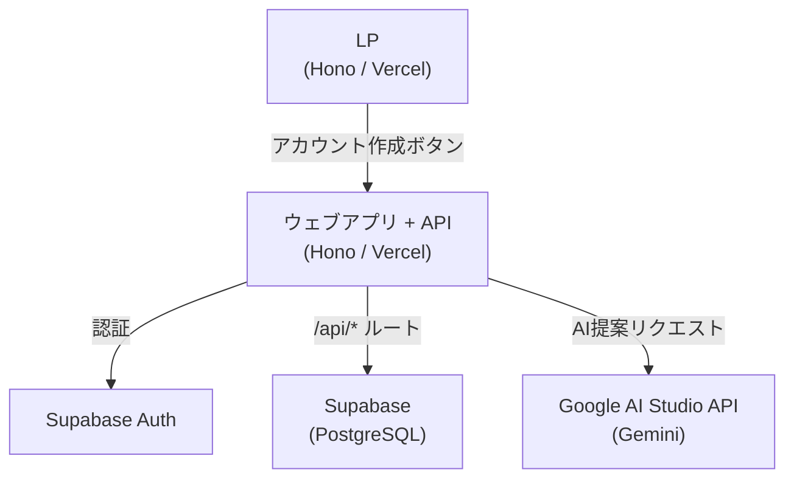

# システム概要

## 目的

**店舗側**: アップサイクルが難しい商品をなんとかしたい店舗と、**ユーザー側**: 夜食に困っていたり、バイト終わりで疲れてコンビニで不健康なものを買いがちな学生をつなぐ。健康的なサラダや本格的な賄い飯を、そうしたニーズに届けるサービスを開発する。スマホアプリで在庫を確認したり、AIがその日の気分に合った料理を提案。LP との連携も行う。

**本システムのスコープ**: ビジネスコンテスト用の仮システムのため、**店舗向けの管理画面・API は用意しない**。在庫・商品データは Supabase のダッシュボードやシードで投入し、学生（ユーザー）向けのアプリ・API のみを実装する。

## 技術スタック

| 領域 | 採用技術 |
| --- | --- |
| フロント / LP / バックエンドAPI | **Hono**（Vercel）一括。ページと API を同一アプリで提供 |
| ホスティング | **Vercel**（フロント・API ともに同一プロジェクトでデプロイ） |
| 認証 | Supabase Auth（`@supabase/supabase-js` で認証・DB・セッション管理を統一） |
| データベース | Supabase（PostgreSQL） |
| AI提案 | Google AI Studio API（TypeScript から Gemini API を呼び出し。本番化時に Vertex AI へ移行可） |
| インフラ | Vercel で完結。GCP は必要に応じて（例: Secret Manager）のみ。Terraform は任意 |
| フロント 3D | Three.js（広場シーン・キャラクター） |
| フロント UI（アイコン） | react-icons で統一 |

---

# システム設計

## アーキテクチャ概要



## 構成要素詳細

### LP / フロント・バックエンド（Hono / Vercel）

- **Hono 単一アプリ**で、LP・ウェブアプリ画面と **API（/api/*）** の両方を提供する
- Vercel にデプロイし、ページは JSX/SSR、API は Hono のルートハンドラで実装
- 「アカウントを作成する」ボタンからサインアップ画面へ誘導
- フロントは同一オリジンの `/api/*` にリクエストし、認証時は Supabase のアクセストークンを `Authorization: Bearer` で付与する

### 認証システム

- Supabase Auth を利用
- 認証方式はメール（ワンタイムパスワード）または Google ログイン
- LP からアプリへの遷移時にそのまま登録・ログイン画面へ誘導
- フロントは Supabase のセッションを保持し、API 呼び出し時にアクセストークンを付与
- Supabase の RLS（Row Level Security）でユーザーごとのデータアクセス制御を行う

### バックエンドAPI（Hono ルート）

- フロントと同じ Hono アプリ内に **`/api/*`** ルートを定義する
- Supabase クライアント（サーバー側）で DB アクセス。AI 提案は Google AI Studio（Gemini）を TypeScript から呼び出す
- 主要エンドポイント
    - `GET /api/products`：商品一覧・在庫情報を返す（Supabase から取得）
    - `POST /api/suggest`：気分・アレルギー・予算を受け取り、在庫を絞り込んだうえで Gemini を呼び出して提案を返す
- 認証が必要な API は `Authorization: Bearer` を検証し、未認証・不正時は 401 を返す。CORS は必要に応じて設定する

### インフラ

- **Vercel** に Hono アプリをデプロイすれば、フロント・API ともに稼働する
- GCP は必須ではない。機密情報を Secret Manager で扱う場合など、必要に応じて Terraform で GCP リソースを管理する

### 商品選択画面

- Supabase から在庫一覧を取得して表示
- 商品カード形式で残り数・割引率・有効期限を表示
- コンテストのため実際の決済処理は不要

### 自動提案 AI

- `POST /api/suggest` でユーザーの入力（今日の気分・アレルギー等）を受け取る
- Hono API が Supabase から在庫データを取得し、AI に渡す候補を絞り込む
    - `stock > 0` のもののみ対象
    - `expires_at`（賞味期限）が近い順に優先
    - 上位 N 件（例: 20 件）に制限して AI へ渡す
- 絞り込んだ在庫データとユーザー入力からプロンプトを生成
- Hono API が Google AI Studio API（Gemini）を呼び出し、おすすめ商品リストを返す

## データベース設計（Supabase / PostgreSQL）

本システムで扱うデータは **学生（ユーザー）** と **商品** の2軸。認証は Supabase Auth に任せ、ユーザー情報は `profiles` で拡張する。商品は `stores` → `products` → `inventory` の3テーブルで表現する。注文はモック用に `orders` / `order_items` を用意する。

### 学生（ユーザー）まわり

| テーブル | 説明 | 主なカラム |
| --- | --- | --- |
| `auth.users` | Supabase Auth 標準。本設計では触れない。 | （Supabase 管理） |
| `profiles` | 認証ユーザーと 1:1 のプロファイル（学生向け追加情報） | `id` (uuid, PK, auth.users と同一), `display_name` (text), `allergies` (text[]), `created_at`, `updated_at` |

- `id` は `auth.users.id` と一致させ、サインアップ時にトリガで 1 行挿入する想定。
- `allergies` は AI 提案（`/api/suggest`）で「避けたい食材」として利用。

### 商品まわり

| テーブル | 説明 | 主なカラム |
| --- | --- | --- |
| `stores` | 店舗（商品の所属先）。コンテスト用にシード投入。 | `id` (uuid, PK), `name` (text), `floor` (text), `section` (text), `created_at` |
| `products` | 商品マスタ（サラダ・賄い飯など） | `id` (uuid, PK), `store_id` (uuid, FK → stores), `name` (text), `category` (text: "サラダ" / "賄い飯" 等), `price` (integer), `image_url` (text), `created_at` |
| `inventory` | 在庫（1商品1レコードで管理） | `id` (uuid, PK), `product_id` (uuid, FK → products, UNIQUE), `stock` (integer), `discount_rate` (integer 0–100), `expires_at` (timestamptz), `updated_at` |

- `category` は「サラダ」「賄い飯」など、目的（健康的・本格的な夜食）に合わせて運用で決める。
- 在庫は商品ごとに 1 行。`stock > 0` かつ `expires_at` が有効なものを一覧・AI 提案の対象とする。

### 注文（モック）

| テーブル | 説明 | 主なカラム |
| --- | --- | --- |
| `orders` | 注文ヘッダ | `id` (uuid, PK), `user_id` (uuid, FK → auth.users), `status` (text: "pending" / "completed"), `created_at` |
| `order_items` | 注文明細 | `id` (uuid, PK), `order_id` (uuid, FK → orders), `product_id` (uuid, FK → products), `quantity` (integer) |

- 決済は行わず、注文フローと履歴のデモ用。

### RLS（Row Level Security）方針

| テーブル | 方針 |
| --- | --- |
| `profiles` | 認証ユーザーは自分自身の行のみ SELECT / UPDATE 可能。INSERT はサインアップ時トリガで実行。 |
| `stores`, `products`, `inventory` | 全テーブル **誰でも SELECT 可**（未認証も可）。INSERT/UPDATE/DELETE は行わない（店舗側システムなしのため、管理画面や API で更新しない想定）。 |
| `orders`, `order_items` | 認証ユーザーは自分が作成した注文のみ SELECT/INSERT。UPDATE は必要に応じて status 更新のみ。 |

### 初期データ・マイグレーション

- テーブル作成は Supabase の SQL エディタまたはリポジトリ内の `sql/migrations/`（または `backend/infrastructure/db/migrations/` など）のマイグレーション SQL を手動実行する。
- **SQL ファイルの命名**: 連番で管理する。`0001_xxx.sql`, `0002_xxx.sql` のように、`0001` から始まる4桁番号 + `_` + 内容を表すスラッグ（英数字・アンダースコア）とする。例: `0001_create_stores_and_products.sql`, `0002_create_inventory.sql`。
- 店舗・商品・在庫の初期データは SQL シードで投入する（店舗向け画面がないため）。

---

# API設計詳細

## エンドポイント一覧

| メソッド | パス | 説明 | 認証 |
| --- | --- | --- | --- |
| GET | `/api/products` | 商品一覧と在庫情報を取得 | 不要 |
| GET | `/api/products/:id` | 商品詳細を取得 | 不要 |
| GET | `/api/stores` | 店舗一覧を取得 | 不要 |
| POST | `/api/suggest` | 気分を送信しAI提案を取得 | 必要 |
| POST | `/api/orders` | 注文を作成（モック） | 必要 |
| GET | `/api/users/me` | ログイン中のユーザー情報を取得 | 必要 |

## `POST /api/suggest` リクエスト・レスポンス例

```json
// リクエスト
{
  "mood": "さっぱりしたものが食べたい",
  "allergies": ["卵"],
  "budget": 1500
}

// レスポンス
{
  "suggestions": [
    {
      "product_id": "abc123",
      "name": "鮮魚の昆布締め",
      "reason": "さっぱりした味わいで予算内に収まります",
      "discount_rate": 30,
      "price_after_discount": 980
    }
  ]
}
```

---

# ディレクトリ構成

## アプリ全体（Hono・フロント＋API）

- ログイン後の画面構成・ナビゲーション・3D 広場などは **[frontend-design.md](./frontend-design.md)** を参照。

```text
frontend/                    # または app/ など単一リポジトリルート
├── src/
│   ├── index.tsx             # 全ルートを束ねる（ページ＋API）
│   ├── routes/
│   │   ├── auth.tsx          # ログイン、新規登録
│   │   └── app.tsx           # /app/* ホーム・検索・広場・商品一覧・アカウント設定
│   ├── api/                  # バックエンドAPI（Hono ルート）
│   │   ├── index.ts          # /api のマウント
│   │   ├── products.ts       # GET /api/products, GET /api/products/:id
│   │   ├── stores.ts         # GET /api/stores
│   │   ├── suggest.ts        # POST /api/suggest（Gemini 呼び出し）
│   │   ├── orders.ts         # POST /api/orders
│   │   ├── users.ts          # GET /api/users/me
│   │   └── middleware/       # JWT 検証など
│   ├── pages/
│   │   ├── lp.tsx
│   │   └── app/
│   ├── components/
│   └── lib/                  # Supabase クライアント、API 用ユーティリティ
└── vercel.json
```

- **API** は同じ Hono アプリの `/api/*` として実装し、Supabase（サーバー用クライアント）・Gemini を呼び出す。
- 認証が必要な API では、リクエストの `Authorization: Bearer` を検証し、Supabase JWT の検証またはセッション確認を行う。

## インフラ

- **Vercel** にデプロイするだけでフロント・API が動作する。
- 詳細は [infra-design.md](./infra-design.md) を参照。Terraform は GCP リソース（Secret Manager 等）を扱う場合のみ利用する。
